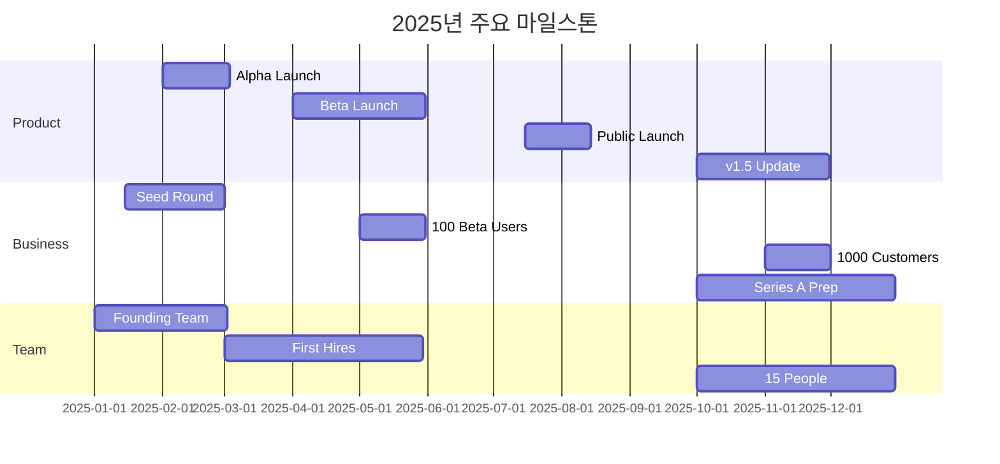

# 🗺️ Auto Report Builder - 로드맵 및 마일스톤

## 목차
1. [전체 로드맵 개요](#1-전체-로드맵-개요)
2. [2025년 로드맵](#2-2025년-로드맵)
3. [2026년 로드맵](#3-2026년-로드맵) 
4. [2027-2029년 장기 로드맵](#4-2027-2029년-장기-로드맵)
5. [주요 마일스톤](#5-주요-마일스톤)
6. [기능 개발 로드맵](#6-기능-개발-로드맵)
7. [기술 로드맵](#7-기술-로드맵)
8. [비즈니스 로드맵](#8-비즈니스-로드맵)
9. [성공 지표](#9-성공-지표)
10. [위험 요소 및 대응](#10-위험-요소-및-대응)

---

## 1. 전체 로드맵 개요

### 비전 타임라인

```
2025: Foundation - "제품 완성과 시장 검증"
2026: Growth - "빠른 성장과 시장 확대"
2027: Scale - "규모화와 수익성"
2028: Expansion - "글로벌 진출"
2029: Leadership - "시장 리더십"
```

### 핵심 목표

| 연도 | 핵심 목표 | 주요 지표 |
|------|-----------|-----------|
| 2025 | PMF 달성 | 1,000 유료 고객 |
| 2026 | 시장 확대 | 5,000 유료 고객 |
| 2027 | 수익성 달성 | EBITDA 흑자 |
| 2028 | 글로벌 진출 | 해외 매출 30% |
| 2029 | 시장 리더 | ARR ₩60B |

## 2. 2025년 로드맵

### Q1 2025 (1-3월): Foundation

#### 개발
- [x] 코어 아키텍처 설계
- [ ] MVP 백엔드 개발
- [ ] MVP 프론트엔드 개발
- [ ] 기본 AI 통합

#### 비즈니스
- [ ] 법인 설립
- [ ] 초기 팀 구성 (5명)
- [ ] 시드 투자 유치 (₩2B)
- [ ] 브랜드 아이덴티티 확립

#### 주요 산출물
- Alpha 버전 출시
- 10명 내부 테스터
- 시드 라운드 클로징

### Q2 2025 (4-6월): Beta Launch

#### 개발
- [ ] Beta 버전 완성
- [ ] 5개 핵심 연동 (GitHub, Slack, Google Docs, Notion, Jira)
- [ ] AI 분석 엔진 v1.0
- [ ] 기본 템플릿 10종

#### 마케팅
- [ ] 웹사이트 런칭
- [ ] 콘텐츠 마케팅 시작
- [ ] 100명 베타 테스터 모집
- [ ] 초기 사용자 피드백 수집

#### 마일스톤
- **M1**: 클로즈드 베타 시작 (4월)
- **M2**: 100명 베타 사용자 (5월)
- **M3**: NPS 50+ 달성 (6월)

### Q3 2025 (7-9월): Public Launch

#### 개발
- [ ] v1.0 정식 출시
- [ ] 10개 추가 연동
- [ ] 모바일 앱 (iOS/Android)
- [ ] API 공개

#### 영업/마케팅
- [ ] Product Hunt 런칭
- [ ] 유료 마케팅 시작
- [ ] 첫 100명 유료 고객
- [ ] 파트너십 3개 체결

#### 마일스톤
- **M4**: 정식 런칭 (7월 15일)
- **M5**: MRR ₩10M 달성 (8월)
- **M6**: 500명 총 사용자 (9월)

### Q4 2025 (10-12월): Growth Foundation

#### 개발
- [ ] v1.5 업데이트
- [ ] 엔터프라이즈 기능
- [ ] 고급 AI 기능
- [ ] 보안 강화 (SOC2 준비)

#### 비즈니스
- [ ] Series A 준비
- [ ] 1,000명 유료 고객
- [ ] MRR ₩42M 달성
- [ ] 팀 확장 (15명)

#### 마일스톤
- **M7**: 1,000 유료 고객 (11월)
- **M8**: ARR ₩500M 달성 (12월)
- **M9**: Series A 텀시트 (12월)

## 3. 2026년 로드맵

### Q1 2026: Scaling

#### 제품
- [ ] v2.0 메이저 업데이트
- [ ] AI 모델 자체 개발
- [ ] 실시간 대시보드
- [ ] 30+ 연동 지원

#### 비즈니스
- [ ] Series A 클로징 (₩10B)
- [ ] 일본 시장 진출
- [ ] 팀 30명 확장
- [ ] 2,000 유료 고객

### Q2 2026: Market Expansion

#### 제품
- [ ] 다국어 지원 (영/일/중)
- [ ] 업종별 솔루션
- [ ] 마켓플레이스 오픈
- [ ] 고급 분석 기능

#### 마케팅
- [ ] 대규모 마케팅 캠페인
- [ ] 컨퍼런스 참가/주최
- [ ] 인플루언서 마케팅
- [ ] SEO/SEM 최적화

### Q3 2026: Enterprise Focus

#### 제품
- [ ] 엔터프라이즈 v1.0
- [ ] 온프레미스 옵션
- [ ] 고급 보안 기능
- [ ] SLA 99.9%

#### 영업
- [ ] 엔터프라이즈 세일즈 팀
- [ ] 10개 대기업 고객
- [ ] 채널 파트너 10개
- [ ] 컨설팅 서비스

### Q4 2026: Profitability Push

#### 목표
- [ ] 5,000 유료 고객
- [ ] ARR ₩3B
- [ ] 매출총이익률 85%
- [ ] 팀 50명

#### 마일스톤
- **M10**: 5,000 유료 고객 (10월)
- **M11**: 일본 매출 ₩500M (11월)
- **M12**: Series B 준비 (12월)

## 4. 2027-2029년 장기 로드맵

### 2027년: Scale & Optimize

#### Q1-Q2
- [ ] 미국 시장 진출
- [ ] v3.0 플랫폼 전환
- [ ] AI 자동화 확대
- [ ] M&A 1건 (기술 인수)

#### Q3-Q4
- [ ] 15,000 유료 고객
- [ ] ARR ₩10B
- [ ] EBITDA 흑자 전환
- [ ] Series B 클로징 (₩30B)

#### 연간 목표
- IPO 준비 시작
- 100명 조직
- 3개국 진출

### 2028년: Global Expansion

#### 주요 이니셔티브
- [ ] 미국 전체 확장
- [ ] 유럽 진출 (영/독/프)
- [ ] 플랫폼 생태계 구축
- [ ] 40,000 유료 고객

#### 비즈니스 목표
- ARR ₩30B
- 해외 매출 30%
- EBITDA 마진 25%
- 200명 글로벌 팀

### 2029년: Market Leadership

#### 전략 목표
- [ ] 아시아 1위
- [ ] 미국 Top 5
- [ ] 75,000 유료 고객
- [ ] ARR ₩60B

#### Exit 준비
- IPO 준비 완료
- 또는 전략적 M&A
- 밸류에이션 ₩1조+

## 5. 주요 마일스톤

### 2025년 핵심 마일스톤



### 성공 기준 (Success Criteria)

| 마일스톤 | 목표일 | 성공 기준 | 상태 |
|----------|--------|-----------|------|
| MVP 완성 | 2025.03 | 핵심 기능 5개 | 🟡 진행중 |
| Beta 런칭 | 2025.04 | 100명 테스터 | ⏳ 대기 |
| PMF 달성 | 2025.06 | NPS 50+, 리텐션 80% | ⏳ 대기 |
| 정식 런칭 | 2025.07 | 일일 사용자 100명 | ⏳ 대기 |
| 수익화 | 2025.09 | MRR ₩10M | ⏳ 대기 |
| Series A | 2026.02 | ₩10B 투자 유치 | ⏳ 대기 |

## 6. 기능 개발 로드맵

### Phase 1: Core (2025 Q1-Q2)
```
✅ 기본 보고서 생성
✅ 5개 데이터 소스 연동
✅ 템플릿 시스템
✅ 스케줄링
□ AI 기본 분석
```

### Phase 2: Enhancement (2025 Q3-Q4)
```
□ 고급 AI 분석
□ 커스텀 템플릿 빌더
□ 실시간 알림
□ 협업 기능
□ API 공개
```

### Phase 3: Advanced (2026)
```
□ 머신러닝 예측
□ 자연어 쿼리
□ 비주얼 대시보드
□ 워크플로우 자동화
□ 마켓플레이스
```

### Phase 4: Platform (2027+)
```
□ 개발자 생태계
□ 플러그인 시스템
□ 엔터프라이즈 플랫폼
□ AI 어시스턴트
□ 노코드 자동화
```

## 7. 기술 로드맵

### 인프라 진화

#### 2025: Startup Stack
```yaml
hosting: AWS (Single Region)
database: PostgreSQL
cache: Redis
queue: Bull
monitoring: Basic
```

#### 2026: Growth Stack
```yaml
hosting: Multi-Region AWS
database: PostgreSQL + Read Replicas
cache: Redis Cluster
queue: RabbitMQ
monitoring: Datadog
cdn: CloudFlare
```

#### 2027+: Scale Stack
```yaml
hosting: Multi-Cloud (AWS + GCP)
database: Distributed PostgreSQL
cache: Global Redis
queue: Kafka
monitoring: Full Observability
edge: Global CDN
```

### AI/ML 로드맵

```
2025 Q1: GPT-4 API 통합
2025 Q2: Gemini Pro 통합
2025 Q3: Claude 3 통합
2025 Q4: Fine-tuning 시작
2026 Q1: 자체 모델 v1.0
2026 Q2: 멀티모달 지원
2026 Q3: 실시간 학습
2027: AutoML 플랫폼
```

## 8. 비즈니스 로드맵

### 고객 획득 전략

#### 2025: Product-Led
- 무료 체험 중심
- 바이럴 성장
- 커뮤니티 구축
- 목표: 1,000 고객

#### 2026: Hybrid
- PLG + Sales
- 파트너십 확대
- 컨퍼런스 마케팅
- 목표: 5,000 고객

#### 2027+: Enterprise
- 엔터프라이즈 세일즈
- 글로벌 파트너
- 산업별 특화
- 목표: 15,000+ 고객

### 수익 다변화

```
2025: 구독료 100%
2026: 구독 85% + 서비스 15%
2027: 구독 70% + 서비스 20% + API 10%
2028: 구독 60% + 서비스 20% + API 15% + 마켓 5%
2029: 플랫폼 수수료 추가
```

## 9. 성공 지표

### 북극성 지표 (North Star Metrics)

| 시기 | 핵심 지표 | 목표 |
|------|-----------|------|
| 2025 Q1-Q2 | 주간 활성 사용자 | 100+ |
| 2025 Q3-Q4 | 유료 전환율 | 10%+ |
| 2026 | Net Revenue Retention | 120%+ |
| 2027 | EBITDA 마진 | 20%+ |
| 2028+ | 시장 점유율 | 10%+ |

### OKR 프레임워크

#### 2025 Q1 OKRs
```
Objective: 시장에 사랑받는 MVP 출시
KR1: NPS 50+ 달성
KR2: 100명 베타 사용자 확보
KR3: 주간 리텐션 80% 달성
```

#### 2025 Q2 OKRs
```
Objective: Product-Market Fit 검증
KR1: 10명 유료 고객 확보
KR2: MRR ₩1M 달성
KR3: CAC < ₩100,000
```

### 선행 지표 vs 후행 지표

#### 선행 지표 (Leading)
- 신규 가입자/주
- 무료→유료 전환 시간
- 기능 사용률
- NPS 점수

#### 후행 지표 (Lagging)
- MRR/ARR
- Churn Rate
- LTV/CAC
- EBITDA

## 10. 위험 요소 및 대응

### 주요 리스크

#### 기술 리스크
| 리스크 | 확률 | 영향 | 대응 계획 |
|--------|------|------|-----------|
| AI API 비용 상승 | 높음 | 높음 | 자체 모델 개발 가속화 |
| 보안 사고 | 낮음 | 매우높음 | SOC2, 보험, 24/7 모니터링 |
| 확장성 이슈 | 중간 | 높음 | 마이크로서비스, 오토스케일링 |

#### 시장 리스크
| 리스크 | 확률 | 영향 | 대응 계획 |
|--------|------|------|-----------|
| 대기업 진입 | 높음 | 높음 | 니치 시장, 빠른 혁신 |
| 경기 침체 | 중간 | 높음 | 프리미엄→저가, 해외 확대 |
| 규제 변화 | 낮음 | 중간 | 컴플라이언스 팀, 로비 |

### 컨틴전시 플랜

#### Plan A: 정상 성장
- 계획대로 진행
- 2029년 IPO/M&A

#### Plan B: 느린 성장
- 비용 절감 30%
- 니치 시장 집중
- 수익성 우선

#### Plan C: 피벗
- B2C 전환
- 플랫폼 모델
- 기술 라이선싱

#### Plan D: Exit
- 조기 M&A
- 자산 매각
- 팀 인수

---

## 실행 체크리스트

### 2025년 1월 (즉시 실행)
- [ ] 법인 설립 완료
- [ ] 초기 팀 5명 채용
- [ ] 사무실 계약
- [ ] 개발 환경 구축
- [ ] 시드 투자자 미팅

### 2025년 2월
- [ ] MVP 개발 50% 완료
- [ ] 브랜드 아이덴티티 확정
- [ ] 웹사이트 디자인
- [ ] 첫 블로그 포스트
- [ ] 알파 테스터 모집

### 2025년 3월
- [ ] MVP 완성
- [ ] 내부 테스트
- [ ] 피드백 수집
- [ ] 베타 준비
- [ ] 시드 라운드 클로징

---

*최종 업데이트: 2025년 1월*  
*버전: 1.0*  
*작성자: Auto Report Builder Strategy Team*  
*다음 리뷰: 2025년 4월*