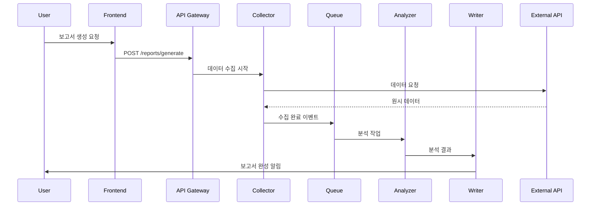

# 🔧 Auto Report Builder - 기술 명세서

## 목차
1. [시스템 아키텍처](#1-시스템-아키텍처)
2. [기술 스택](#2-기술-스택)
3. [핵심 컴포넌트](#3-핵심-컴포넌트)
4. [데이터 플로우](#4-데이터-플로우)
5. [API 설계](#5-api-설계)
6. [데이터베이스 설계](#6-데이터베이스-설계)
7. [보안 및 인증](#7-보안-및-인증)
8. [성능 최적화](#8-성능-최적화)
9. [배포 전략](#9-배포-전략)
10. [모니터링 및 로깅](#10-모니터링-및-로깅)

---

## 1. 시스템 아키텍처

### 1.1 전체 아키텍처

```
┌────────────────────────────────────────────────────────────┐
│                        Client Layer                         │
│  ┌──────────────┐  ┌──────────────┐  ┌──────────────┐    │
│  │   Web App    │  │  Mobile App  │  │   API Client │    │
│  │  (Next.js)   │  │(React Native)│  │   (REST)     │    │
│  └──────────────┘  └──────────────┘  └──────────────┘    │
└────────────────────────────────────────────────────────────┘
                              │
                              ▼
┌────────────────────────────────────────────────────────────┐
│                      API Gateway Layer                      │
│  ┌──────────────────────────────────────────────────┐    │
│  │          Kong API Gateway / AWS API Gateway       │    │
│  │    (Rate Limiting, Auth, Caching, Routing)       │    │
│  └──────────────────────────────────────────────────┘    │
└────────────────────────────────────────────────────────────┘
                              │
                              ▼
┌────────────────────────────────────────────────────────────┐
│                    Microservices Layer                      │
│  ┌────────────┐  ┌────────────┐  ┌────────────┐         │
│  │   Auth     │  │  Collector │  │  Analyzer  │         │
│  │  Service   │  │   Service  │  │   Service  │         │
│  └────────────┘  └────────────┘  └────────────┘         │
│  ┌────────────┐  ┌────────────┐  ┌────────────┐         │
│  │   Writer   │  │  Scheduler │  │ Notification│         │
│  │  Service   │  │   Service  │  │   Service  │         │
│  └────────────┘  └────────────┘  └────────────┘         │
└────────────────────────────────────────────────────────────┘
                              │
                              ▼
┌────────────────────────────────────────────────────────────┐
│                      Message Queue                          │
│              RabbitMQ / AWS SQS / Google Pub/Sub           │
└────────────────────────────────────────────────────────────┘
                              │
                              ▼
┌────────────────────────────────────────────────────────────┐
│                      Data Layer                             │
│  ┌──────────────┐  ┌──────────────┐  ┌──────────────┐    │
│  │  PostgreSQL  │  │    Redis     │  │  TimescaleDB │    │
│  │   (Primary)  │  │   (Cache)    │  │  (Time-series)│   │
│  └──────────────┘  └──────────────┘  └──────────────┘    │
└────────────────────────────────────────────────────────────┘
                              │
                              ▼
┌────────────────────────────────────────────────────────────┐
│                    External Services                        │
│  GitHub API | Slack API | Google APIs | OpenAI/Claude API  │
└────────────────────────────────────────────────────────────┘
```

### 1.2 마이크로서비스 아키텍처

각 서비스는 독립적으로 배포 가능하며, Docker 컨테이너로 패키징됩니다.

| 서비스 | 책임 | 기술 스택 | 포트 |
|--------|------|-----------|------|
| Auth Service | 인증/인가 | Node.js, JWT | 3001 |
| Collector Service | 데이터 수집 | Python, Celery | 3002 |
| Analyzer Service | AI 분석 | Python, FastAPI | 3003 |
| Writer Service | 보고서 작성 | Node.js, Puppeteer | 3004 |
| Scheduler Service | 작업 스케줄링 | Node.js, Bull | 3005 |
| Notification Service | 알림 발송 | Node.js, SendGrid | 3006 |

## 2. 기술 스택

### 2.1 Frontend
```json
{
  "framework": "Next.js 14",
  "language": "TypeScript 5.3",
  "styling": "Tailwind CSS 3.4",
  "ui-components": "shadcn/ui",
  "state-management": "Zustand",
  "data-fetching": "TanStack Query",
  "forms": "React Hook Form + Zod",
  "charts": "Recharts",
  "editor": "Monaco Editor",
  "drag-drop": "react-beautiful-dnd"
}
```

### 2.2 Backend
```json
{
  "runtime": "Node.js 20 LTS",
  "framework": "Express.js / Fastify",
  "language": "TypeScript",
  "orm": "Prisma",
  "validation": "Joi / Yup",
  "authentication": "Passport.js",
  "queue": "Bull (Redis)",
  "websocket": "Socket.io",
  "testing": "Jest, Supertest"
}
```

### 2.3 Infrastructure
```yaml
cloud-providers:
  primary: AWS
  secondary: GCP
  cdn: Cloudflare

container:
  orchestration: Kubernetes (EKS)
  registry: ECR
  runtime: Docker

ci-cd:
  pipeline: GitHub Actions
  deployment: ArgoCD
  monitoring: Datadog

databases:
  primary: PostgreSQL 15
  cache: Redis 7
  timeseries: TimescaleDB
  search: Elasticsearch
```

## 3. 핵심 컴포넌트

### 3.1 Collector Service

```typescript
// 데이터 수집 인터페이스
interface DataCollector {
  source: DataSource;
  authenticate(): Promise<void>;
  fetchData(params: FetchParams): Promise<RawData>;
  transform(data: RawData): Promise<StandardData>;
  validate(data: StandardData): boolean;
}

// 수집 전략 패턴
class CollectorStrategy {
  private collectors: Map<string, DataCollector>;
  
  async collect(sources: DataSource[]): Promise<CollectedData> {
    const results = await Promise.allSettled(
      sources.map(source => this.collectFromSource(source))
    );
    return this.mergeResults(results);
  }
}

// 수집 파이프라인
class CollectionPipeline {
  stages = [
    authenticate,
    fetchData,
    transform,
    validate,
    store,
    notify
  ];
  
  async execute(config: CollectionConfig) {
    return this.stages.reduce(
      (promise, stage) => promise.then(stage),
      Promise.resolve(config)
    );
  }
}
```

### 3.2 Analyzer Service

```python
# AI 분석 엔진
class AIAnalyzer:
    def __init__(self):
        self.models = {
            'gpt4': OpenAIModel(),
            'claude': ClaudeModel(),
            'gemini': GeminiModel(),
            'custom': CustomModel()
        }
    
    async def analyze(self, data: Dict, config: AnalysisConfig) -> AnalysisResult:
        # 데이터 전처리
        processed = self.preprocess(data)
        
        # 모델 선택
        model = self.models[config.model_type]
        
        # 분석 실행
        result = await model.analyze(processed, config.prompt)
        
        # 후처리 및 검증
        return self.postprocess(result)
    
    def calculate_priority(self, tasks: List[Task]) -> List[PrioritizedTask]:
        """우선순위 점수 계산 알고리즘"""
        weights = {
            'urgency': 0.3,
            'impact': 0.3,
            'dependencies': 0.2,
            'effort': 0.1,
            'deadline': 0.1
        }
        
        for task in tasks:
            score = sum(
                getattr(task, key) * weight 
                for key, weight in weights.items()
            )
            task.priority_score = score
        
        return sorted(tasks, key=lambda x: x.priority_score, reverse=True)
```

### 3.3 Writer Service

```typescript
// 보고서 작성 엔진
class ReportWriter {
  private templates: TemplateEngine;
  private formatters: Map<OutputFormat, Formatter>;
  
  async generateReport(
    data: AnalyzedData,
    template: Template,
    output: OutputConfig
  ): Promise<Report> {
    // 템플릿 렌더링
    const content = await this.templates.render(template, data);
    
    // 포맷팅
    const formatter = this.formatters.get(output.format);
    const formatted = await formatter.format(content);
    
    // 출력 처리
    return this.publishReport(formatted, output);
  }
  
  private async publishReport(report: FormattedReport, config: OutputConfig) {
    switch(config.destination) {
      case 'google-docs':
        return this.googleDocsWriter.write(report);
      case 'notion':
        return this.notionWriter.write(report);
      case 'confluence':
        return this.confluenceWriter.write(report);
      default:
        throw new Error(`Unsupported destination: ${config.destination}`);
    }
  }
}
```

## 4. 데이터 플로우

### 4.1 실시간 데이터 수집 플로우



### 4.2 배치 처리 플로우

```yaml
schedule:
  daily-report:
    cron: "0 10 * * 1-5"  # 평일 오전 10시
    steps:
      - collect-all-sources
      - aggregate-data
      - analyze-trends
      - generate-report
      - send-notifications
    
  weekly-summary:
    cron: "0 9 * * 1"  # 월요일 오전 9시
    steps:
      - collect-weekly-data
      - calculate-metrics
      - compare-with-previous
      - generate-summary
      - distribute-report
```

## 5. API 설계

### 5.1 RESTful API 엔드포인트

```yaml
# 인증
POST   /api/v1/auth/signup
POST   /api/v1/auth/login
POST   /api/v1/auth/refresh
POST   /api/v1/auth/logout

# 보고서
GET    /api/v1/reports
POST   /api/v1/reports
GET    /api/v1/reports/:id
PUT    /api/v1/reports/:id
DELETE /api/v1/reports/:id
POST   /api/v1/reports/:id/generate
GET    /api/v1/reports/:id/status

# 데이터 소스
GET    /api/v1/sources
POST   /api/v1/sources
PUT    /api/v1/sources/:id
DELETE /api/v1/sources/:id
POST   /api/v1/sources/:id/test
POST   /api/v1/sources/:id/sync

# 템플릿
GET    /api/v1/templates
POST   /api/v1/templates
GET    /api/v1/templates/:id
PUT    /api/v1/templates/:id
DELETE /api/v1/templates/:id
POST   /api/v1/templates/:id/clone

# 스케줄
GET    /api/v1/schedules
POST   /api/v1/schedules
PUT    /api/v1/schedules/:id
DELETE /api/v1/schedules/:id
POST   /api/v1/schedules/:id/run

# 웹훅
POST   /api/v1/webhooks/github
POST   /api/v1/webhooks/slack
POST   /api/v1/webhooks/custom
```

### 5.2 GraphQL Schema

```graphql
type Query {
  # 사용자
  me: User!
  user(id: ID!): User
  
  # 보고서
  reports(filter: ReportFilter, pagination: Pagination): ReportConnection!
  report(id: ID!): Report
  
  # 데이터 소스
  sources: [DataSource!]!
  source(id: ID!): DataSource
  
  # 템플릿
  templates(category: String): [Template!]!
  template(id: ID!): Template
  
  # 분석
  analytics(dateRange: DateRange!): Analytics!
}

type Mutation {
  # 보고서 관리
  createReport(input: CreateReportInput!): Report!
  updateReport(id: ID!, input: UpdateReportInput!): Report!
  deleteReport(id: ID!): Boolean!
  generateReport(id: ID!): GenerateReportPayload!
  
  # 데이터 소스 관리
  connectSource(input: ConnectSourceInput!): DataSource!
  updateSource(id: ID!, input: UpdateSourceInput!): DataSource!
  disconnectSource(id: ID!): Boolean!
  
  # 템플릿 관리
  createTemplate(input: CreateTemplateInput!): Template!
  updateTemplate(id: ID!, input: UpdateTemplateInput!): Template!
  deleteTemplate(id: ID!): Boolean!
}

type Subscription {
  reportGenerated(reportId: ID!): Report!
  sourceStatusChanged(sourceId: ID!): DataSource!
  notificationReceived: Notification!
}
```

## 6. 데이터베이스 설계

### 6.1 주요 테이블 스키마

```sql
-- 사용자 테이블
CREATE TABLE users (
    id UUID PRIMARY KEY DEFAULT gen_random_uuid(),
    email VARCHAR(255) UNIQUE NOT NULL,
    password_hash VARCHAR(255),
    name VARCHAR(255),
    avatar_url TEXT,
    role VARCHAR(50) DEFAULT 'user',
    subscription_tier VARCHAR(50) DEFAULT 'free',
    created_at TIMESTAMP DEFAULT CURRENT_TIMESTAMP,
    updated_at TIMESTAMP DEFAULT CURRENT_TIMESTAMP,
    last_login_at TIMESTAMP,
    is_active BOOLEAN DEFAULT true
);

-- 조직 테이블
CREATE TABLE organizations (
    id UUID PRIMARY KEY DEFAULT gen_random_uuid(),
    name VARCHAR(255) NOT NULL,
    slug VARCHAR(255) UNIQUE NOT NULL,
    owner_id UUID REFERENCES users(id),
    subscription_tier VARCHAR(50) DEFAULT 'free',
    max_users INTEGER DEFAULT 1,
    max_reports INTEGER DEFAULT 3,
    created_at TIMESTAMP DEFAULT CURRENT_TIMESTAMP
);

-- 보고서 테이블
CREATE TABLE reports (
    id UUID PRIMARY KEY DEFAULT gen_random_uuid(),
    organization_id UUID REFERENCES organizations(id),
    name VARCHAR(255) NOT NULL,
    description TEXT,
    template_id UUID REFERENCES templates(id),
    schedule_config JSONB,
    output_config JSONB,
    is_active BOOLEAN DEFAULT true,
    created_by UUID REFERENCES users(id),
    created_at TIMESTAMP DEFAULT CURRENT_TIMESTAMP,
    updated_at TIMESTAMP DEFAULT CURRENT_TIMESTAMP
);

-- 데이터 소스 테이블
CREATE TABLE data_sources (
    id UUID PRIMARY KEY DEFAULT gen_random_uuid(),
    organization_id UUID REFERENCES organizations(id),
    type VARCHAR(50) NOT NULL, -- github, slack, firebase, etc.
    name VARCHAR(255) NOT NULL,
    config JSONB NOT NULL, -- 암호화된 연결 정보
    status VARCHAR(50) DEFAULT 'connected',
    last_sync_at TIMESTAMP,
    created_at TIMESTAMP DEFAULT CURRENT_TIMESTAMP
);

-- 보고서 실행 기록
CREATE TABLE report_executions (
    id UUID PRIMARY KEY DEFAULT gen_random_uuid(),
    report_id UUID REFERENCES reports(id),
    status VARCHAR(50) NOT NULL, -- pending, running, completed, failed
    started_at TIMESTAMP DEFAULT CURRENT_TIMESTAMP,
    completed_at TIMESTAMP,
    duration_ms INTEGER,
    output_url TEXT,
    error_message TEXT,
    metadata JSONB
);

-- 템플릿 테이블
CREATE TABLE templates (
    id UUID PRIMARY KEY DEFAULT gen_random_uuid(),
    name VARCHAR(255) NOT NULL,
    category VARCHAR(50),
    description TEXT,
    schema JSONB NOT NULL,
    layout JSONB NOT NULL,
    is_public BOOLEAN DEFAULT false,
    created_by UUID REFERENCES users(id),
    created_at TIMESTAMP DEFAULT CURRENT_TIMESTAMP
);

-- 인덱스
CREATE INDEX idx_reports_org_id ON reports(organization_id);
CREATE INDEX idx_report_executions_report_id ON report_executions(report_id);
CREATE INDEX idx_report_executions_status ON report_executions(status);
CREATE INDEX idx_data_sources_org_id ON data_sources(organization_id);
CREATE INDEX idx_templates_category ON templates(category);
CREATE INDEX idx_templates_is_public ON templates(is_public);
```

### 6.2 Redis 캐싱 전략

```typescript
// 캐싱 키 구조
const cacheKeys = {
  user: (id: string) => `user:${id}`,
  report: (id: string) => `report:${id}`,
  source: (id: string) => `source:${id}`,
  sourceData: (id: string) => `source:data:${id}`,
  analytics: (orgId: string, date: string) => `analytics:${orgId}:${date}`,
  session: (token: string) => `session:${token}`
};

// 캐시 TTL 설정
const cacheTTL = {
  user: 3600,        // 1시간
  report: 1800,      // 30분
  sourceData: 300,   // 5분
  analytics: 86400,  // 1일
  session: 7200      // 2시간
};
```

## 7. 보안 및 인증

### 7.1 인증 플로우

```typescript
// JWT 기반 인증
interface JWTPayload {
  userId: string;
  email: string;
  organizationId: string;
  role: UserRole;
  subscription: SubscriptionTier;
}

class AuthService {
  generateTokens(user: User) {
    const accessToken = jwt.sign(
      payload,
      process.env.JWT_ACCESS_SECRET,
      { expiresIn: '15m' }
    );
    
    const refreshToken = jwt.sign(
      payload,
      process.env.JWT_REFRESH_SECRET,
      { expiresIn: '7d' }
    );
    
    return { accessToken, refreshToken };
  }
  
  async validateToken(token: string): Promise<JWTPayload> {
    try {
      return jwt.verify(token, process.env.JWT_ACCESS_SECRET);
    } catch (error) {
      throw new UnauthorizedException('Invalid token');
    }
  }
}
```

### 7.2 보안 정책

```yaml
security:
  encryption:
    at-rest: AES-256-GCM
    in-transit: TLS 1.3
    key-management: AWS KMS
  
  authentication:
    method: JWT + Refresh Token
    mfa: TOTP (Google Authenticator)
    session-timeout: 30 minutes
  
  authorization:
    model: RBAC (Role-Based Access Control)
    roles: [admin, owner, editor, viewer]
    permissions: granular per resource
  
  api-security:
    rate-limiting: 100 req/min per user
    ddos-protection: Cloudflare
    cors: whitelist-based
    csp: strict policy
  
  data-protection:
    pii-encryption: field-level
    audit-logging: all data access
    retention: 90 days
    gdpr-compliant: true
  
  vulnerability-management:
    dependency-scanning: Snyk
    code-scanning: SonarQube
    penetration-testing: quarterly
    bug-bounty: HackerOne
```

### 7.3 API 키 관리

```typescript
// API 키 생성 및 관리
class APIKeyManager {
  async generateAPIKey(userId: string, name: string): Promise<APIKey> {
    const key = crypto.randomBytes(32).toString('hex');
    const hashedKey = await bcrypt.hash(key, 10);
    
    await db.apiKeys.create({
      userId,
      name,
      key: hashedKey,
      prefix: key.substring(0, 8),
      lastUsedAt: null,
      expiresAt: addDays(new Date(), 90)
    });
    
    return {
      key: `arb_${key}`,
      name,
      createdAt: new Date()
    };
  }
  
  async validateAPIKey(key: string): Promise<boolean> {
    const prefix = key.substring(4, 12);
    const apiKey = await db.apiKeys.findOne({ prefix });
    
    if (!apiKey || apiKey.expiresAt < new Date()) {
      return false;
    }
    
    const isValid = await bcrypt.compare(key.substring(4), apiKey.key);
    
    if (isValid) {
      await db.apiKeys.update(apiKey.id, { lastUsedAt: new Date() });
    }
    
    return isValid;
  }
}
```

## 8. 성능 최적화

### 8.1 데이터베이스 최적화

```sql
-- 파티셔닝 전략
CREATE TABLE report_executions_2025_01 PARTITION OF report_executions
FOR VALUES FROM ('2025-01-01') TO ('2025-02-01');

-- 인덱스 최적화
CREATE INDEX CONCURRENTLY idx_reports_active_org 
ON reports(organization_id, is_active) 
WHERE is_active = true;

-- 머티리얼라이즈드 뷰
CREATE MATERIALIZED VIEW mv_daily_analytics AS
SELECT 
    organization_id,
    DATE(created_at) as date,
    COUNT(*) as total_reports,
    AVG(duration_ms) as avg_duration,
    COUNT(CASE WHEN status = 'completed' THEN 1 END) as successful_reports
FROM report_executions
GROUP BY organization_id, DATE(created_at);

-- 자동 VACUUM 설정
ALTER TABLE report_executions SET (autovacuum_vacuum_scale_factor = 0.1);
```

### 8.2 캐싱 전략

```typescript
// 다층 캐싱 구조
class CacheManager {
  private l1Cache: Map<string, any> = new Map(); // 메모리 캐시
  private l2Cache: Redis; // Redis 캐시
  private l3Cache: CDN; // CDN 캐시
  
  async get(key: string): Promise<any> {
    // L1 체크
    if (this.l1Cache.has(key)) {
      return this.l1Cache.get(key);
    }
    
    // L2 체크
    const l2Value = await this.l2Cache.get(key);
    if (l2Value) {
      this.l1Cache.set(key, l2Value);
      return l2Value;
    }
    
    // L3 체크
    const l3Value = await this.l3Cache.get(key);
    if (l3Value) {
      await this.l2Cache.set(key, l3Value);
      this.l1Cache.set(key, l3Value);
      return l3Value;
    }
    
    return null;
  }
}
```

### 8.3 쿼리 최적화

```typescript
// N+1 문제 해결
class ReportRepository {
  async findWithRelations(reportId: string) {
    return prisma.report.findUnique({
      where: { id: reportId },
      include: {
        template: true,
        dataSources: true,
        executions: {
          take: 10,
          orderBy: { createdAt: 'desc' }
        },
        organization: {
          include: {
            users: true
          }
        }
      }
    });
  }
  
  // 배치 로딩
  async findManyWithDataLoader(ids: string[]) {
    const dataLoader = new DataLoader(async (reportIds: string[]) => {
      const reports = await prisma.report.findMany({
        where: { id: { in: reportIds } }
      });
      
      return reportIds.map(id => 
        reports.find(report => report.id === id)
      );
    });
    
    return Promise.all(ids.map(id => dataLoader.load(id)));
  }
}
```

## 9. 배포 전략

### 9.1 CI/CD 파이프라인

```yaml
# .github/workflows/deploy.yml
name: Deploy to Production

on:
  push:
    branches: [main]

jobs:
  test:
    runs-on: ubuntu-latest
    steps:
      - uses: actions/checkout@v3
      - uses: actions/setup-node@v3
      - run: npm ci
      - run: npm test
      - run: npm run test:e2e

  build:
    needs: test
    runs-on: ubuntu-latest
    steps:
      - uses: actions/checkout@v3
      - name: Build Docker images
        run: |
          docker build -t arb-frontend:${{ github.sha }} ./frontend
          docker build -t arb-backend:${{ github.sha }} ./backend
      
      - name: Push to ECR
        run: |
          aws ecr get-login-password | docker login --username AWS --password-stdin $ECR_REGISTRY
          docker push $ECR_REGISTRY/arb-frontend:${{ github.sha }}
          docker push $ECR_REGISTRY/arb-backend:${{ github.sha }}

  deploy:
    needs: build
    runs-on: ubuntu-latest
    steps:
      - name: Deploy to Kubernetes
        run: |
          kubectl set image deployment/frontend frontend=$ECR_REGISTRY/arb-frontend:${{ github.sha }}
          kubectl set image deployment/backend backend=$ECR_REGISTRY/arb-backend:${{ github.sha }}
          kubectl rollout status deployment/frontend
          kubectl rollout status deployment/backend
```

### 9.2 Kubernetes 배포 설정

```yaml
# k8s/deployment.yaml
apiVersion: apps/v1
kind: Deployment
metadata:
  name: arb-backend
spec:
  replicas: 3
  strategy:
    type: RollingUpdate
    rollingUpdate:
      maxSurge: 1
      maxUnavailable: 0
  selector:
    matchLabels:
      app: arb-backend
  template:
    metadata:
      labels:
        app: arb-backend
    spec:
      containers:
      - name: backend
        image: arb-backend:latest
        ports:
        - containerPort: 3000
        env:
        - name: NODE_ENV
          value: production
        - name: DATABASE_URL
          valueFrom:
            secretKeyRef:
              name: arb-secrets
              key: database-url
        resources:
          requests:
            memory: "256Mi"
            cpu: "250m"
          limits:
            memory: "512Mi"
            cpu: "500m"
        livenessProbe:
          httpGet:
            path: /health
            port: 3000
          initialDelaySeconds: 30
          periodSeconds: 10
        readinessProbe:
          httpGet:
            path: /ready
            port: 3000
          initialDelaySeconds: 5
          periodSeconds: 5
```

### 9.3 Blue-Green 배포

```typescript
// 배포 스크립트
class BlueGreenDeployment {
  async deploy(version: string) {
    // 1. Green 환경에 새 버전 배포
    await this.deployToGreen(version);
    
    // 2. 헬스 체크
    const isHealthy = await this.healthCheck('green');
    if (!isHealthy) {
      throw new Error('Green deployment health check failed');
    }
    
    // 3. 트래픽 전환
    await this.switchTraffic('blue', 'green');
    
    // 4. 모니터링 (5분)
    await this.monitor('green', 5 * 60 * 1000);
    
    // 5. Blue 환경 업데이트
    await this.deployToBlue(version);
    
    return { success: true, version };
  }
  
  async rollback() {
    await this.switchTraffic('green', 'blue');
  }
}
```

## 10. 모니터링 및 로깅

### 10.1 모니터링 스택

```yaml
monitoring:
  metrics:
    collector: Prometheus
    storage: Victoria Metrics
    visualization: Grafana
    
  logs:
    collector: Fluentd
    storage: Elasticsearch
    visualization: Kibana
    
  tracing:
    collector: OpenTelemetry
    storage: Jaeger
    
  apm:
    service: Datadog / New Relic
    
  alerts:
    manager: AlertManager
    channels: [slack, email, pagerduty]
```

### 10.2 핵심 메트릭

```typescript
// 커스텀 메트릭 정의
const metrics = {
  // 비즈니스 메트릭
  reports_generated: new Counter({
    name: 'arb_reports_generated_total',
    help: 'Total number of reports generated',
    labelNames: ['organization', 'template', 'status']
  }),
  
  report_generation_duration: new Histogram({
    name: 'arb_report_generation_duration_seconds',
    help: 'Report generation duration in seconds',
    buckets: [0.1, 0.5, 1, 2, 5, 10, 30, 60]
  }),
  
  active_users: new Gauge({
    name: 'arb_active_users',
    help: 'Number of active users',
    labelNames: ['tier']
  }),
  
  // 시스템 메트릭
  api_request_duration: new Histogram({
    name: 'arb_api_request_duration_seconds',
    help: 'API request duration in seconds',
    labelNames: ['method', 'route', 'status']
  }),
  
  database_connection_pool: new Gauge({
    name: 'arb_database_connection_pool',
    help: 'Database connection pool status',
    labelNames: ['status'] // active, idle, waiting
  })
};
```

### 10.3 로깅 전략

```typescript
// 구조화된 로깅
import winston from 'winston';

const logger = winston.createLogger({
  format: winston.format.combine(
    winston.format.timestamp(),
    winston.format.errors({ stack: true }),
    winston.format.json()
  ),
  defaultMeta: { 
    service: 'arb-backend',
    environment: process.env.NODE_ENV 
  },
  transports: [
    new winston.transports.Console({
      format: winston.format.simple()
    }),
    new winston.transports.File({ 
      filename: 'error.log', 
      level: 'error' 
    }),
    new winston.transports.File({ 
      filename: 'combined.log' 
    })
  ]
});

// 로그 레벨
logger.error('Database connection failed', { 
  error: err.message, 
  stack: err.stack,
  userId: user.id 
});

logger.info('Report generated successfully', {
  reportId: report.id,
  duration: duration,
  organizationId: org.id
});

logger.debug('Cache hit', { 
  key: cacheKey, 
  ttl: remainingTTL 
});
```

### 10.4 알림 규칙

```yaml
alerts:
  - name: HighErrorRate
    expr: rate(arb_api_requests_total{status=~"5.."}[5m]) > 0.05
    for: 5m
    annotations:
      summary: "High error rate detected"
      description: "Error rate is above 5% for 5 minutes"
    
  - name: SlowReportGeneration
    expr: histogram_quantile(0.95, arb_report_generation_duration_seconds) > 30
    for: 10m
    annotations:
      summary: "Report generation is slow"
      description: "95th percentile of report generation time is above 30 seconds"
    
  - name: DatabaseConnectionPoolExhausted
    expr: arb_database_connection_pool{status="waiting"} > 10
    for: 5m
    annotations:
      summary: "Database connection pool exhausted"
      description: "More than 10 connections waiting in the pool"
```

---

## 다음 단계

1. ✅ MVP 개발 시작
2. ✅ 인프라 구축
3. ✅ 보안 감사
4. ✅ 성능 테스트
5. ✅ 문서화 완성

---

*최종 업데이트: 2025년 1월*  
*버전: 1.0*  
*작성자: Auto Report Builder Engineering Team*